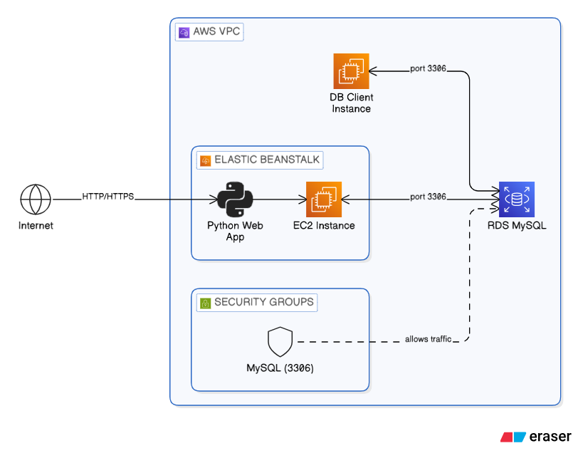
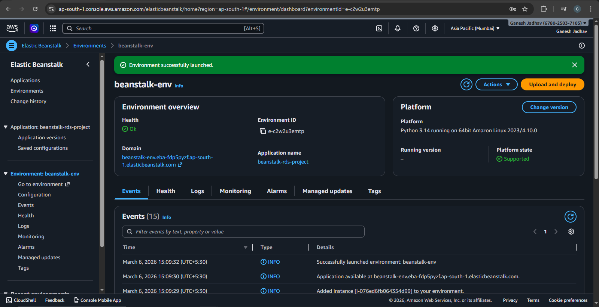
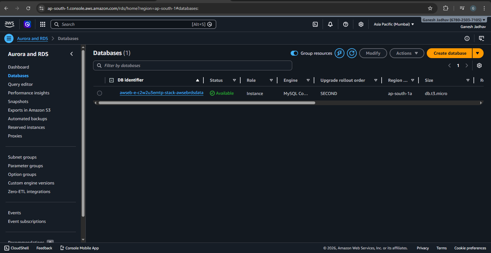
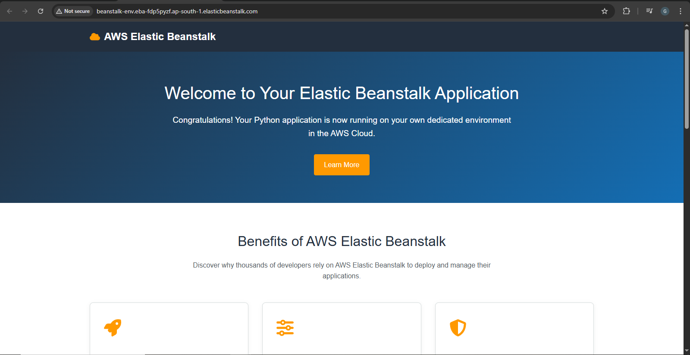
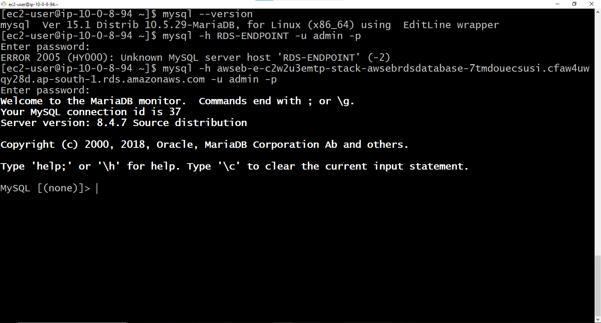
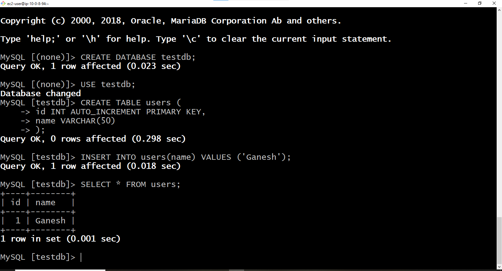

# Using AWS Elastic Beanstalk to Set Up RDS and Access It from an EC2 Instance

## Project Overview

This project demonstrates how to deploy a web application using **AWS Elastic Beanstalk**, automatically provision an **Amazon RDS database**, and securely access the database from a **separate EC2 instance** within the same VPC.

The goal of this project is to understand how AWS managed services work together in a real cloud environment while following security best practices.

---

## Architecture



Elastic Beanstalk hosts the application and automatically creates an RDS database inside the same VPC. A separate EC2 instance connects to the RDS database securely using security group rules.

---

## Technologies Used

| Service | Purpose |
|--------|--------|
| AWS Elastic Beanstalk | Deploy and manage web application |
| Amazon EC2 | Application server and database client |
| Amazon RDS | Managed relational database |
| Amazon VPC | Network isolation |
| Security Groups | Control database access |
| Amazon CloudWatch | Monitoring and logs |

---

## Step-by-Step Implementation

### 1. Create Elastic Beanstalk Environment

1. Login to **AWS Console**
2. Navigate to **Elastic Beanstalk**
3. Click **Create Application**

Configuration:

Application Name: eb-rds-project  
Environment Name: eb-rds-env  
Platform: Python (or Node.js / PHP)  
Application Code: Sample Application

---

### 2. Configure Networking

Select the default VPC and required subnets.

Enable public IP for the web server instances.

---

### 3. Add Database (RDS)

During environment creation, configure database settings.

Engine: MySQL  
Instance Class: db.t3.micro  
Storage: 20 GB  
Username: admin  
Password: ********  
Public Accessibility: Disabled  

Elastic Beanstalk will automatically create the RDS instance in the same VPC.

---

### 4. Deploy Environment

Click **Create Environment**.

Elastic Beanstalk will automatically:

- Launch EC2 instances
- Configure load balancer
- Create RDS database
- Deploy sample application

Deployment usually takes **5–10 minutes**.

---

### 5. Verify RDS Database

Go to:

AWS Console → RDS → Databases

Copy the **RDS Endpoint**.

Example:

```
eb-rds-env.xxxxxx.ap-south-1.rds.amazonaws.com
```

---

### 6. Launch EC2 Instance for Database Access

Create a new EC2 instance.

Name: rds-client-ec2  
AMI: Amazon Linux 2023  
Instance Type: t2.micro  
VPC: Same VPC as Beanstalk environment  

---

### 7. Configure Security Groups

Modify the RDS security group and add inbound rules.

| Type | Port | Source |
|-----|-----|-----|
| MySQL | 3306 | Elastic Beanstalk Security Group |
| MySQL | 3306 | EC2 Client Security Group |

This allows only trusted instances to access the database.

---

### 8. SSH into EC2

```
ssh -i key.pem ec2-user@EC2-PUBLIC-IP
```

---

### 9. Install MySQL Client

```
sudo dnf update -y
sudo dnf install mysql -y
```

Verify installation:

```
mysql --version
```

---

### 10. Connect to RDS Database

```
mysql -h RDS-ENDPOINT -u admin -p
```

Example:

```
mysql -h eb-rds-env.xxxxxx.ap-south-1.rds.amazonaws.com -u admin -p
```

Enter the database password.

---

### 11. Perform Database Operations

```
CREATE DATABASE projectdb;

USE projectdb;

CREATE TABLE users (
id INT AUTO_INCREMENT PRIMARY KEY,
name VARCHAR(50)
);

INSERT INTO users (name) VALUES ('Ganesh');

SELECT * FROM users;
```

Example Output:

```
+----+--------+
| id | name   |
+----+--------+
|  1 | Ganesh |
+----+--------+
```

---

## Optional Enhancements

### Secure Credentials

Store database credentials using:

- AWS Systems Manager Parameter Store
- AWS Secrets Manager

---

### Monitoring

Use **Amazon CloudWatch** to monitor:

- CPU Utilization
- Database connections
- Storage usage
- Network traffic

---

## Security Considerations

- RDS database is **not publicly accessible**
- Access restricted using **security groups**
- Only Elastic Beanstalk instances and EC2 client instance can connect
- SSH access restricted to authorized users

---

## Screenshots

| Sr No | Screenshot Name | Image |
|------|----------------|------|
| 1 | Elastic Beanstalk Environment |  |
| 2 | RDS Database |   |
| 3 | Web Output |  |
| 4 | Database Connection |  |
| 5 | Query Output |   |
---

## Learning Outcomes

This project demonstrates:

- Deployment using AWS Elastic Beanstalk
- Automatic provisioning of Amazon RDS
- Secure database connectivity using VPC and Security Groups
- Managing AWS infrastructure for real-world applications

---

## Author

Ganesh Jadhav  
DevOps & AWS Intern
Github: https://github.com/iam-ganeshjadhav  
Linkedin: https://www.linkedin.com/in/ganesh-jadhav-30813a267  
E-mailID: jadhavg9370@gmail.com   